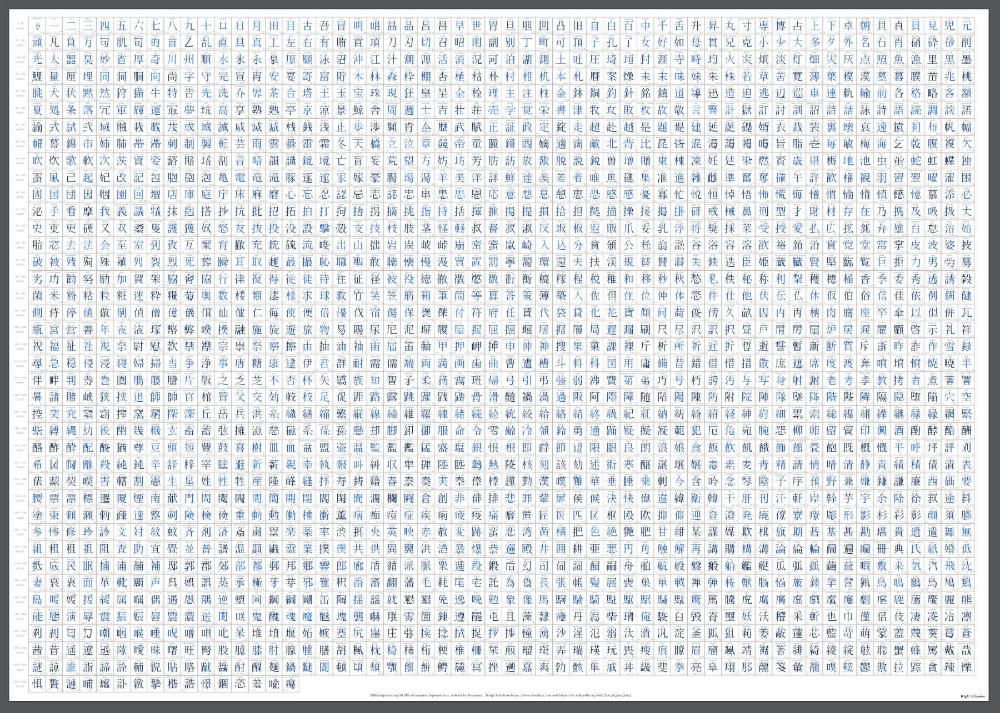

# Kanji Poster



A simple python script to generate the LaTeX source for a poster to show all [jōyō kanji](https://en.wikipedia.org/wiki/List_of_jōyō_kanji) as well as the extra kanji included in [WaniKani](https://www.wanikani.com).

In total the poster includes 2200 kanji. The script supports varies ways of sorting and coloring the kanji; in the screenshot above they are sorted according to the order they occur in [Remembering the Kanji](https://en.wikipedia.org/wiki/Remembering_the_Kanji_and_Remembering_the_Hanzi) by James Heisig and colored according to the log of their frequency in some common texts.

I've also checked in an [example version](https://github.com/Mononofu/kanji_poster/blob/master/main.pdf) of the poster you can download. Note that this is still a work in progress, I have not checked the poster for correctness.

## Usage

```bash
# Generate the LaTeX files.
python3 list_kanji.py

# Compile everything into a pdf.
pdflatex main.tex
```

## Dependencies

The script uses [colour](https://pypi.org/project/colour/) to interpolate colors and [jaconv](https://pypi.org/project/jaconv/) to convert between hiragana and katakana for readings; you can install both from pip.
